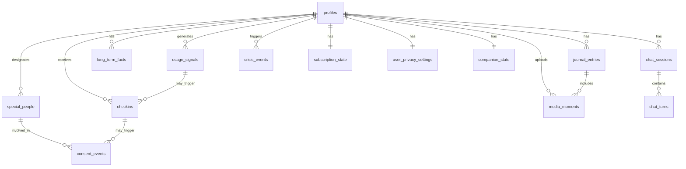

# Database Design Doc — Tama

**Status:** Draft v1
**Depends on:** `tama-prd.md`, `tama-companion-ai-design.md`, `tama-system-architecture.md`
**Feeds into:** API Design Doc, Testing & Deployment Guide
**Platform:** Supabase (Postgres)
**Audience note:** Written to be directly actionable by human developers and AI coding agents. Table definitions are close to literal DDL intent — treat column names/types as the actual implementation baseline, not just illustrative.

---

## 1. Expandability Principles (read this before adding any table)

The single biggest cause of painful schema migrations later is locking in rigid structure too early. These rules apply to every table below and to anything added afterward:

1. **Avoid native Postgres `ENUM` types for anything that might grow a new value.** `ALTER TYPE ... ADD VALUE` is restrictive and can't run inside a transaction in older Postgres versions. Use `TEXT` with an application-level allowed-values convention (documented per field below), or a small lookup table if the values need their own metadata. This alone prevents most future migration pain.
2. **Every core table gets a `metadata JSONB` column**, default `'{}'::jsonb`. This gives you a schema-less escape hatch to attach new attributes to a row without a migration, for anything that doesn't yet deserve a first-class column. Promote a JSONB field to a real column later if it becomes heavily queried — that's a cheap, additive migration.
3. **New fields are additive and nullable by default.** Adding a nullable column to an existing table is safe and non-breaking. Avoid `NOT NULL` on new columns unless you're also providing a default — this is what keeps schema evolution seamless without coordinated downtime.
4. **UUID primary keys everywhere** (Supabase default via `gen_random_uuid()`), never sequential integers — avoids merge conflicts and makes future multi-region or offline-sync scenarios easier.
5. **`long_term_facts` (Section 3.3) is intentionally a flexible key/type/value structure, not fixed columns per fact type.** This is the most important expandability decision in the whole schema — new categories of things Tama learns about a user (a new fact type) require zero migrations, just a new `fact_type` value.
6. **Prefer new tables over widening existing ones** when a concept is genuinely new (e.g., adding a new kind of trusted contact later) rather than bolting unrelated columns onto `special_people`. Use foreign keys and junction tables freely.
7. **All migrations are additive-first.** Destructive changes (dropping/renaming columns) require a documented reason and a deprecation window, not an in-place rename — this keeps team members and AI agents working in parallel from breaking each other's in-flight work.

---

## 2. Entity Overview

---

## 3. Core Tables

### 3.1 `profiles`
Extends Supabase `auth.users`.

| Column | Type | Notes |
|---|---|---|
| `id` | uuid, PK | FK to `auth.users.id` |
| `display_name` | text | |
| `preferred_tone` | text | e.g. "gentle" / "direct" / "playful" — free text, not enum (Principle 1) |
| `onboarding_completed_at` | timestamptz, nullable | |
| `created_at` | timestamptz, default now() | |
| `updated_at` | timestamptz, default now() | |
| `metadata` | jsonb, default `{}` | escape hatch (Principle 2) |

### 3.2 `companion_state`
One row per user — tracks the Familiarity/Relationship Growth Model (Companion AI Design Doc Section 7).

| Column | Type | Notes |
|---|---|---|
| `user_id` | uuid, PK, FK → `profiles.id` | |
| `familiarity_stage` | text | "new" / "established" / "deep" — text not enum (Principle 1), values may grow |
| `stage_entered_at` | timestamptz | |
| `communication_style` | jsonb | avg message length, emoji usage, formality signals — Companion AI Design Doc Section 5; JSONB since signal set will evolve |
| `metadata` | jsonb, default `{}` | |
| `updated_at` | timestamptz | |

### 3.3 `long_term_facts`
The Long-Term User Model (Companion AI Design Doc Section 4.3). Deliberately flexible — this is the table most likely to need new kinds of content over time, so it's structured to never need a migration for that.

| Column | Type | Notes |
|---|---|---|
| `id` | uuid, PK | |
| `user_id` | uuid, FK → `profiles.id` | |
| `fact_type` | text | e.g. "person", "preference", "recurring_topic", "communication_pattern" — open-ended, new types added freely |
| `fact_key` | text | e.g. a person's name, or a preference label |
| `fact_value` | jsonb | structured detail — shape varies by `fact_type`, which is exactly why this is JSONB and not fixed columns |
| `confidence` | numeric, nullable | optional weighting if extraction confidence varies |
| `source_journal_entry_id` | uuid, nullable, FK → `journal_entries.id` | traceability back to where this was learned |
| `is_active` | boolean, default true | soft-invalidate outdated facts rather than deleting, preserves history |
| `created_at` | timestamptz | |
| `updated_at` | timestamptz | |

**Index:** `(user_id, fact_type, is_active)` — this is the query pattern used on every chat turn for relevance-ranked retrieval (System Architecture Doc Section 6).

### 3.4 `chat_sessions` / `chat_turns`

**`chat_sessions`**
| Column | Type | Notes |
|---|---|---|
| `id` | uuid, PK | |
| `user_id` | uuid, FK | |
| `started_at` | timestamptz | |
| `ended_at` | timestamptz, nullable | |
| `metadata` | jsonb, default `{}` | |

**`chat_turns`**
| Column | Type | Notes |
|---|---|---|
| `id` | uuid, PK | |
| `session_id` | uuid, FK → `chat_sessions.id` | |
| `user_id` | uuid, FK | denormalized for simpler RLS/queries |
| `role` | text | "user" / "companion" — text not enum |
| `content` | text | |
| `created_at` | timestamptz | |
| `metadata` | jsonb, default `{}` | e.g. model tier used, voice-input flag |

**Index:** `(session_id, created_at)` for working-memory retrieval (Companion AI Design Doc Section 4.1).

### 3.5 `journal_entries`
The Lifebook (PRD Feature 5).

| Column | Type | Notes |
|---|---|---|
| `id` | uuid, PK | |
| `user_id` | uuid, FK | |
| `entry_date` | date | |
| `summary_text` | text | generated by the daily summarization job |
| `is_significant` | boolean, default false | flags episodic/significant moments (Companion AI Design Doc Section 4.4) |
| `mood_tag` | text, nullable | plain-language only, never diagnostic (per PRD 8.3 tone rules) — e.g. "heavy," "light," "busy" |
| `created_at` | timestamptz | |
| `metadata` | jsonb, default `{}` | |

**Index:** `(user_id, entry_date desc)` — primary Lifebook timeline query, and the basis for the "recent memory" 7-14 day window.

### 3.6 `media_moments`
Photo uploads (PRD Feature 6).

| Column | Type | Notes |
|---|---|---|
| `id` | uuid, PK | |
| `user_id` | uuid, FK | |
| `journal_entry_id` | uuid, nullable, FK → `journal_entries.id` | |
| `storage_path` | text | Supabase Storage reference |
| `caption` | text, nullable | |
| `created_at` | timestamptz | |
| `metadata` | jsonb, default `{}` | |

### 3.7 `special_people`
PRD Feature 4.

| Column | Type | Notes |
|---|---|---|
| `id` | uuid, PK | |
| `user_id` | uuid, FK | the person who designated this contact |
| `linked_user_id` | uuid, nullable, FK → `profiles.id` | populated if the Special Person is also a Tama user (future: bidirectional relationships) — nullable now so this doesn't block v1 |
| `name` | text | |
| `relationship_label` | text | free text ("partner," "sister," "best friend") |
| `contact_channel` | text | how they're notified — "push" for now, extensible to email/SMS later without migration since it's text, not enum |
| `contact_reference` | text | e.g. device token or contact identifier |
| `added_at` | timestamptz | |
| `notified_of_role_at` | timestamptz, nullable | when the Special Person themselves was informed they were added (PRD Feature 4 requirement — must not be null before any check-in notification can reference them) |
| `status` | text | "active" / "removed" — text not enum |
| `metadata` | jsonb, default `{}` | |

### 3.8 `consent_events`
The consent-based notify flow (PRD Feature 4) — this table is the architectural proof that no auto-notify path exists.

| Column | Type | Notes |
|---|---|---|
| `id` | uuid, PK | |
| `user_id` | uuid, FK | |
| `special_person_id` | uuid, FK → `special_people.id` | |
| `triggering_checkin_id` | uuid, nullable, FK → `checkins.id` | |
| `proposed_message` | text | what Tama suggested |
| `user_decision` | text | "approved" / "edited" / "declined" — text not enum |
| `final_message` | text, nullable | null if declined |
| `decided_at` | timestamptz, nullable | null until the user responds |
| `created_at` | timestamptz | |

### 3.9 `usage_signals`
Derived deviation signals only — per System Architecture Doc Principle 3, raw usage logs never reach the backend.

| Column | Type | Notes |
|---|---|---|
| `id` | uuid, PK | |
| `user_id` | uuid, FK | |
| `signal_date` | date | |
| `deviation_detected` | boolean | |
| `magnitude` | text | e.g. "mild" / "significant" — text not enum, derived on-device |
| `created_at` | timestamptz | |
| `metadata` | jsonb, default `{}` | room for richer signal shape later without migration |

### 3.10 `checkins`
Generated proactive check-in messages (Companion AI Design Doc Section 6.3).

| Column | Type | Notes |
|---|---|---|
| `id` | uuid, PK | |
| `user_id` | uuid, FK | |
| `trigger_type` | text | "pattern_deviation" / "milestone" / "manual" — text not enum, new trigger types expected over time |
| `usage_signal_id` | uuid, nullable, FK → `usage_signals.id` | |
| `generated_message` | text | |
| `delivered_at` | timestamptz, nullable | |
| `created_at` | timestamptz | |

### 3.11 `crisis_events`
Safety audit log (Companion AI Design Doc Section 8.2). Deliberately minimal — logs that the safety path fired, not the sensitive content that triggered it, to avoid over-retaining highly sensitive data.

| Column | Type | Notes |
|---|---|---|
| `id` | uuid, PK | |
| `user_id` | uuid, FK | |
| `triggered_at` | timestamptz | |
| `resource_shown` | boolean | |
| `metadata` | jsonb, default `{}` | intentionally minimal by default — do not log raw message content here without a specific, deliberate decision and legal/ethical review, since this table is a sensitive-data magnet by nature |

### 3.12 `subscription_state`
RevenueCat sync (PRD Section 6, Economy).

| Column | Type | Notes |
|---|---|---|
| `user_id` | uuid, PK, FK → `profiles.id` | |
| `revenuecat_customer_id` | text | |
| `tier` | text | "free" / "premium" — text not enum |
| `status` | text | "active" / "expired" / "cancelled" etc. — text not enum |
| `renewed_at` | timestamptz, nullable | |
| `expires_at` | timestamptz, nullable | |
| `raw_webhook_payload` | jsonb, nullable | last webhook payload verbatim, invaluable for debugging without a migration |
| `updated_at` | timestamptz | |

### 3.13 `user_privacy_settings`
PRD Feature 8.7 (trust/safety screen).

| Column | Type | Notes |
|---|---|---|
| `user_id` | uuid, PK, FK → `profiles.id` | |
| `usage_tracking_opt_in` | boolean, default false | must be explicit opt-in, never defaulted true |
| `data_sharing_prefs` | jsonb, default `{}` | room to grow as more granular controls are added |
| `updated_at` | timestamptz | |

---

## 4. Row-Level Security (RLS)

- Default policy on every table: a row is readable/writable only where `user_id = auth.uid()`.
- Exception requiring care: `special_people.linked_user_id` and any future bidirectional relationship data — if a Special Person is also a Tama user, their own `profiles` row remains governed by their own `user_id`, not exposed via the relationship. Do not create a policy that lets one user read another user's `profiles` or `long_term_facts` row through the `special_people` link.
- `consent_events` and `checkins` are written only by Edge Functions (service role), never directly by client-side inserts, since they represent system-generated proposals the user is responding to, not free-form user data.

---

## 5. Indexing Summary

| Table | Index | Query it serves |
|---|---|---|
| `long_term_facts` | `(user_id, fact_type, is_active)` | relevance-ranked retrieval on every chat turn |
| `chat_turns` | `(session_id, created_at)` | working memory / session history |
| `journal_entries` | `(user_id, entry_date desc)` | Lifebook timeline, recent-memory window |
| `usage_signals` | `(user_id, signal_date desc)` | baseline/deviation history |
| `special_people` | `(user_id, status)` | active contact list |

---

## 6. Migration Workflow

- Use Supabase's standard migration files, one logical change per migration, additive-first (Principle 3/7).
- Every new table gets a `metadata jsonb default '{}'` column by convention, even if unused at creation — cheaper to add now than to migrate onto every row later.
- Before adding a new fixed column to an existing table, ask: "will this value set grow?" If yes, it either belongs in `long_term_facts` (if it's about what Tama knows about the user) or as a new `text` field with documented allowed values (never a native `ENUM`).

---

## 7. Open Items

- `linked_user_id` on `special_people` is included now as a nullable, unused-in-v1 field specifically to avoid a schema change later if/when bidirectional relationships (both partners using Tama) become a real feature — confirm this doesn't need RLS handling until it's actually populated.
- Confirm data retention/expiry policy for `usage_signals` and `crisis_events` specifically, given their sensitivity — likely a candidate for a scheduled cleanup job post-hackathon, not required for v1 but worth flagging now.

---

## 8. Next Document

**API Design Doc** — will define the concrete Edge Function contracts (request/response shapes) for `chat-turn`, `daily-summarize`, `extract-facts`, `generate-checkin`, `notify-special-person`, and `crisis-check`, built directly on top of this schema.
