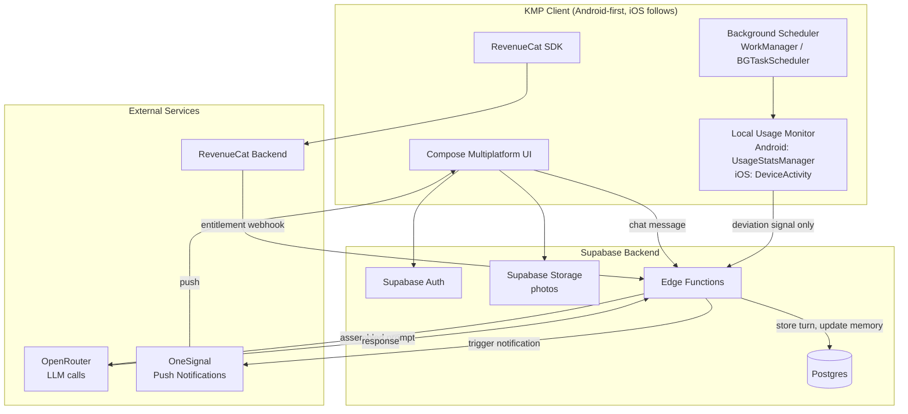

# System Architecture Doc — Tama

**Status:** Draft v1
**Depends on:** `tama-prd.md`, `tama-companion-ai-design.md`
**Feeds into:** Database Design Doc, API Design Doc, Testing & Deployment Guide
**Audience note:** Written to be directly actionable by human developers and AI coding agents implementing the system.

---

## 1. Architecture Principles

1. **Shared logic in Kotlin Multiplatform.** Chat state, memory assembly triggers, sync logic, and data models live in shared KMP code. Platform-specific code is limited to what genuinely must differ: usage-tracking APIs (Android `UsageStatsManager` vs iOS `DeviceActivity`/Family Controls), background scheduling (`WorkManager` vs `BGTaskScheduler`), and native UI rendering (Compose Multiplatform per-platform theming).
2. **Prompt assembly happens server-side, never on-device.** API keys for OpenRouter must not live on the client. All persona + memory assembly (per the Companion AI Design Doc) happens in a backend Edge Function.
3. **Raw usage data stays on-device wherever possible.** Only derived signals (e.g., "deviation detected, magnitude X") are sent to the backend — not raw minute-by-minute usage logs. This is a privacy-by-design decision, not just a data-minimization nicety, and it directly supports the honest privacy claims required in PRD Section 8.7.
4. **Background jobs are decoupled from live chat.** Journal summarization and long-term memory updates run as separate scheduled/triggered jobs, never blocking the live chat response path.
5. **The safety layer (crisis language detection) is architecturally independent** of the persona/memory system — it must function even if memory retrieval or the background job pipeline fails.
6. **Android-first, but no platform-exclusive core data models.** iOS parity should require adding platform-specific modules, not restructuring shared data.

---

## 2. High-Level System Diagram

---

## 3. Component Breakdown

### 3.1 Client (KMP + Compose Multiplatform)
- **Shared module:** chat UI logic, data models, sync/state management, RevenueCat SDK integration, API client for Edge Functions.
- **Platform module (expect/actual pattern):** usage-tracking implementation, background task scheduling, push notification registration, Family Controls entitlement handling (iOS only).
- **Local Usage Monitor:** computes the user's own rolling baseline on-device where feasible; only sends a derived deviation signal to the backend, not raw logs (Principle 3).

### 3.2 Backend (Supabase)
- **Auth:** Supabase Auth (email/OAuth per PRD onboarding).
- **Postgres:** primary data store — see Database Design Doc for schema.
- **Storage:** photo uploads (compressed client-side before upload per PRD Feature 6).
- **Edge Functions:** the orchestration layer. This is where persona + memory assembly (Companion AI Design Doc Sections 3-4) actually executes. Key functions (finalized in API Design Doc):
  - `chat-turn` — receives a user message, assembles context, calls OpenRouter, returns response, persists the turn
  - `daily-summarize` — scheduled/triggered background job (Companion AI Design Doc Section 6.1)
  - `extract-facts` — background job updating the Long-Term User Model (Section 6.2)
  - `generate-checkin` — triggered by a deviation signal from the client (Section 6.3)
  - `notify-special-person` — only fires after explicit user consent (PRD Feature 4), never automatically
  - `crisis-check` — see Section 5.5

### 3.3 External Services
| Service | Purpose | Notes |
|---|---|---|
| OpenRouter | All LLM calls (chat, summarization, extraction, check-in generation) | Model routed per tier, see Companion AI Design Doc Section 2 |
| OneSignal | Push notifications | Check-ins, post-consent Special Person alerts, milestone recaps |
| RevenueCat | Subscription/paywall management | SDK on client, webhook to backend for entitlement sync |
| Google Play / App Store | Distribution | Android-first; iOS pending Family Controls entitlement approval |

---

## 4. Data Flow — Core Roles

### 4.1 Daily Conversation (PRD Feature 2, Companion AI Design Doc Section 3-5)
1. User sends message via client UI.
2. Client calls `chat-turn` Edge Function with message + session context.
3. Edge Function retrieves: persona (static), recent memory (last 7-14 days of journal entries), relevance-ranked long-term facts, current familiarity stage.
4. Edge Function assembles the full prompt and calls OpenRouter (strong model tier for live chat).
5. Response returned to client, rendered, and the turn is persisted to Postgres (working memory for the session).

### 4.2 Daily Journal Summarization + Memory Update (background)
1. Triggered end-of-day (scheduled) or on session end, per active user.
2. `daily-summarize` calls OpenRouter (cheap tier) to generate the journal entry from that day's conversation(s).
3. `extract-facts` runs alongside/after, updating the Long-Term User Model (structured, not raw text — Companion AI Design Doc Section 4.3).
4. Both write to Postgres. This is what populates the Lifebook view (PRD Feature 5).

### 4.3 Pattern Detection → Proactive Check-In (PRD Feature 3)
1. Local Usage Monitor computes the user's rolling baseline entirely on-device.
2. On detecting meaningful deviation, the client sends only a minimal derived signal to the backend (not raw usage logs) — e.g., "deviation detected, magnitude: high."
3. `generate-checkin` Edge Function assembles persona + recent memory context and calls OpenRouter (strong tier) to write a specific, personalized message.
4. Message delivered via OneSignal push.

### 4.4 Special Person Consent Flow (PRD Feature 4)
1. After a check-in (4.3) or in-chat, Tama asks the user directly whether to notify a designated Special Person.
2. User approves (optionally edits the message) via client UI.
3. Only upon explicit approval does the client call `notify-special-person`.
4. **No code path exists that allows this Edge Function to be invoked without a prior explicit user approval event** — this is enforced architecturally, not just by UI convention, per PRD Feature 4 acceptance criteria.

### 4.5 Crisis Language Detection (PRD Feature 3, Companion AI Design Doc Section 8.2)
1. Runs as a fast, independent check on every incoming user message — ideally a lightweight client-side or edge-level keyword/intent check that does not wait on the full chat-turn round trip.
2. On trigger: immediately surfaces crisis resources in-app, independent of and faster than the chat-turn response and independent of the background job pipeline.
3. This path must not depend on OpenRouter availability, memory retrieval, or any other component that could fail or be slow — it is the one part of the system designed to degrade gracefully to "always works."

---

## 5. Security & Privacy Architecture

- **Encryption:** data encrypted at rest (Postgres) and in transit (TLS). Per PRD Section 8.7: encryption, not hashing — hashing is one-way and unsuitable for data that must be retrieved and displayed later (e.g., journal entries, chat history).
- **Access control:** Row-Level Security (RLS) in Supabase — every user can only read/write their own rows. Special Person notification records are scoped similarly.
- **Data minimization:** raw usage data never leaves the device (Principle 3); only derived signals are transmitted and stored.
- **No third-party training use:** data is not used to train external models, consistent with the honest privacy claim required in PRD Section 8.7 (do not claim "nothing reaches our servers" — the LLM calls genuinely require server-side processing; the accurate claim is encryption + minimization + no resale + no third-party training use + deletable on request).
- **Deletion:** a user-triggered full account/data deletion path must exist and actually remove data across Postgres and Storage, not just soft-delete flags — needed both ethically and for store compliance.

---

## 6. Scalability Notes (Shipaton scale, not enterprise scale)

Not a priority at hackathon scale, but worth building correctly from the start since it's cheap to do so now and expensive to retrofit:
- Edge Functions are stateless — no in-memory session state that would break under multiple instances.
- Long-Term User Model retrieval should be indexed (finalized in Database Design Doc) since prompt assembly happens on every chat turn.
- Recent memory (last 7-14 days) is small and cheap to fetch in full; no need for premature optimization here.

---

## 7. Platform-Specific Notes

- **Android:** `UsageStatsManager` requires a one-time special permission granted in system settings (not a runtime permission dialog) — the onboarding/permission flow (PRD Feature 3) must account for this UX difference.
- **iOS:** requires the `com.apple.developer.family-controls` entitlement (applied for in PRD Week 1). If approval doesn't land in time, the client falls back to a reduced/manual check-in trigger rather than blocking the iOS release entirely (PRD Section 7).
- Both platforms share the same backend contract — the Edge Functions and data model do not need to know which platform originated a deviation signal.

---

## 8. Open Items / Risks

- Exact relevance-ranking method for Long-Term User Model retrieval (recency-weighted vs. topic-matched vs. hybrid) — to be finalized in Database Design Doc based on realistic query patterns.
- Client-side vs. edge-level implementation of the crisis-language fast check (Section 4.5) — needs a decision balancing latency against maintainability; both are architecturally acceptable, pick based on team implementation speed.
- Confirm OneSignal delivery latency is acceptable for the check-in use case (should be near-real-time, not batched).

---

## 9. Next Document

**Database Design Doc** — will define the concrete Postgres schema (tables for users, chat turns, journal entries, long-term facts, Special People, consent records, subscription state) implementing the data flows described above.
