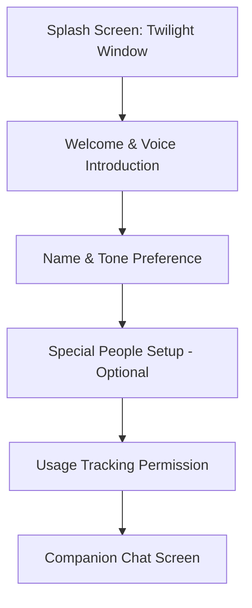

# Tama AI — UI/UX Design System & Screen Specifications

**Status:** Approved Specification (v1.0)  
**Derived From:** `UI MOCKUP/tama-ux-flow.md`, `UI MOCKUP/tama-ui-mockups.jsx`, and Brand Design Kit (`UI MOCKUP/WhatsApp Image *.jpeg`)  
**Target Platform:** Android (Jetpack Compose + Material 3) & Supabase Backend  

---

## 1. Brand Identity & Creative Direction

### 1.1 Mascot: "Tama"
Tama is a soft, warm dumpling-cloud creature with a sprout on its head and expressive dark eyes. Tama is not a robotic assistant or a cold productivity tool — Tama is a gentle, attentive companion that listens, remembers, and quietly cares.

```
       🌱  <- Gentle sprout on head
    ( • ‿ • ) <- Warm, attentive eyes & friendly smile
    (  ⊃☕⊂  ) <- Cozy posture (chin on paws / holding warm mug)
```

#### Mascot Visual States & Expressions
1. **Attentive / Listening (Default):** Resting chin on paws, looking forward with gentle smile. Used in header avatars and voice greeting.
2. **Cozy Puddle / Snuggle:** Flattened, relaxed, smiling blissfully. Used in check-in confirmations and calm moments.
3. **Curious / Pondering:** Side glance, head tilted slightly. Used during AI thinking/generating states.
4. **Sleepy / Night-time:** Dozing with soft "Zzz" next to a steaming mug. Used in late-night check-ins (>11 PM).
5. **Warm Friend:** Holding a steaming mug with both paws. Used in chat empty states and casual conversations.
6. **Companion Sunset:** Sitting side-by-side with a little brown cat looking at the sunset. Used in Lifebook monthly recaps and onboarding milestones.

### 1.2 Brand Slogan & Positioning
- **Name:** Tama AI (stylized with a sprout accent on the **T**)
- **Tagline:** *"Your life, remembered."*
- **Positioning:** *"An AI companion that listens, remembers, and quietly cares — turning your everyday moments into a beautiful, evolving personal journal ('Lifebook')."*
- **Tone & Voice:** Warm, friendly, genuine, human, non-clinical.

---

## 2. Design Tokens & Color Palette

The color system combines **Deep Twilight / Midnight** tones (for nighttime, depth, and premium paywall) with **Warm Rice Paper & Peach** tones (for daytime, cozy reading, and chat).

### 2.1 Color Tokens

| Token Name | Hex Value | Semantic Role |
|---|---|---|
| `TamaBg` | `#FBF3F6` | Default light mode canvas background (soft warm rose-tinted paper) |
| `TamaSurface` | `#FFFFFF` | Card surface, dialogue sheets, input containers |
| `TamaDarkBg` | `#081241` | Deep Midnight Navy (Splash, Night scenes, Paywall background) |
| `TamaDarkSurface` | `#1C1F5F` | Indigo Twilight (Dark mode cards and glass containers) |
| `TamaInk` | `#3A2E42` | Primary typography color (high contrast, warm charcoal-plum) |
| `TamaInkSoft` | `#7A6B82` | Secondary text, timestamps, subtitles, inactive icons |
| `TamaWarmth` | `#E8836B` | Primary interactive brand color (CTA buttons, voice active state) |
| `TamaWarmthSoft` | `#FBE0D8` | Warm highlight background, mascot halo glow, speech bubbles |
| `TamaPeachGlow` | `#FFD9B3` | Cozy sunset peach accent, onboarding highlights |
| `TamaCalm` | `#7FA88F` | Affirmative actions, verified status, sage green badges |
| `TamaCalmSoft` | `#E4EFE8` | Soft green background for tags, approval chips |
| `TamaPeriwinkle` | `#3954FF` | Active accent blue, feature icons |
| `TamaRose` | `#FF81C1` | Love, empathy, Special People heart badges |
| `TamaPremiumGold` | `#C9932E` | Premium badge, Lifebook highlights, gold stars |
| `TamaPremiumSoft` | `#F7EBD3` | Premium card background wash |
| `TamaHairline` | `#EBDDE4` | Subtle borders, dividers, unselected tab outlines |

---

### 2.2 Typography System

- **Display / Heading Font:** `Fraunces` (or rounded serif/humanist display font)
  - Emotional, editorial, bookish aesthetic for Lifebook headers, splash titles, and milestone banners.
- **Body / Interface Font:** `Inter` (Weights: `400 Regular`, `500 Medium`, `600 SemiBold`, `700 Bold`)
  - Clean, modern, highly legible for chat bubbles, input fields, and settings.

```
H1 Display:  Fraunces 26sp / 1.3 line-height / SemiBold
H2 Title:    Fraunces 20sp / 1.35 line-height / Medium
H3 Card:     Fraunces 15sp / 1.4 line-height / SemiBold
Body Main:   Inter 14sp / 1.5 line-height / Regular (Chat bubbles, entries)
Body Bold:   Inter 14sp / 1.5 line-height / SemiBold (Buttons, highlights)
Caption:     Inter 12sp / 1.4 line-height / Regular (Subtitles, explanations)
Overline:    Inter 10sp / 1.2 line-height / Bold, Uppercase (Badges, tags)
```

---

### 2.3 Component Shapes & Elevation

1. **Pill Buttons (`PillButton`):**
   - Height: `48dp` - `52dp`
   - Corner Radius: `999dp` (Full pill shape)
   - Background: `TamaWarmth` (`#E8836B`) or `TamaDarkBg`
   - Typography: Inter 14sp, SemiBold, White text.
2. **Journal Page Cards (`PageCard`):**
   - Corner Radius: `18dp 18dp 18dp 4dp` (Simulating a bound journal page)
   - Signature Detail: A `14dp` triangular dog-ear corner on the bottom-right border (`TamaHairline`).
   - Shadow: `0dp 2dp 12dp rgba(58, 46, 66, 0.06)`
3. **Chat Bubbles:**
   - **User Bubble:** Corner radius `16dp 16dp 4dp 16dp`, Background `TamaInk` (`#3A2E42`), White text.
   - **Companion Bubble:** Corner radius `16dp 16dp 16dp 4dp`, Background `TamaSurface` (`#FFFFFF`), Text `TamaInk`, subtle elevation.
4. **Glassmorphism (Dark / Premium Sheets):**
   - Background: `rgba(28, 31, 95, 0.65)` with backdrop blur `20dp`, 1px border `rgba(255, 255, 255, 0.15)`.

---

## 3. Screen Specifications & User Flows

### Flow 1: Splash & Onboarding



#### 1.1 Splash Screen
- **Visual:** Full-screen night window illustration with Tama resting chin on windowsill next to a warm glowing lamp overlooking a peaceful twilight skyline.
- **Title:** "Tama AI" with sprout mark.
- **Tagline:** "Your life, remembered."
- **Behavior:** Smooth 1.2s fade transition into Welcome Screen.

#### 1.2 Welcome & Voice Introduction Screen
- **Visual:** Centered mascot in glowing `TamaWarmthSoft` circular halo (animated gentle pulse).
- **Header:** "Hi, I'm Tama. I'd like to get to know you." (`Fraunces 26sp`)
- **Subtitle:** Dynamic based on mode:
  - Voice active: *"Tap the mic when you're ready to talk, or switch to typing anytime."*
  - Text mode: *"Type whenever you're ready — we can turn sound on later."*
- **Actions:**
  - Secondary Toggle: *"Switch to typing instead"* / *"Turn sound back on"* (`TamaCalm`, 13sp).
  - Primary CTA: `PillButton` — *"Let's begin →"*
  - Ghost Link: *"Just exploring"*

#### 1.3 Name & Companion Tone Picker
- **Name Input:** Clean rounded text field (`TamaSurface` with `TamaHairline` border).
- **Tone Selection Cards (2x2 Grid):**
  1. **Warm (Default):** *"Gentle, validating, always in your corner."*
  2. **Direct:** *"Honest, grounded, cuts through the noise."*
  3. **Playful:** *"Lighthearted, witty, brings gentle humor."*
  4. **Calm:** *"Quiet, grounding, gives you space to breathe."*

#### 1.4 Special People Setup Screen
- **Philosophy:** Trust & deliberate consent, never a background sync.
- **Card UI:** Input fields for Name, Relationship (Sister, Partner, Best Friend), and Contact info.
- **Trust Note:** *"Jane will be told she's been added as someone you trust to check in on you. We will never message her without your explicit in-chat approval."*
- **Action:** *"Add Jane"* + prominent, honest *"Skip for now"* option.

#### 1.5 Usage-Tracking Permission Explainer
- **Plain-Language Explainer:** Transparently explains that Tama checks aggregate screen-time deviation to notice if you're having late-night distress.
- **Explicit Opt-In:** Switch/button with clear toggle; app remains 100% functional if declined.

---

### Flow 2: Companion Chat & Real-Time Interactions

#### 2.1 Core Chat Screen Layout
- **Top Bar:**
  - Tama Mascot Avatar (`28dp`) with sprout accent.
  - Title: "Tama" (`Fraunces 15sp`).
  - Status Subtitle: *"getting to know you"* / *"listening"* (`TamaCalm`, 10sp SemiBold).
  - Quick action icons: Lifebook shortcut, Settings.
- **Chat Feed:**
  - LazyColumn with fluid spring animations for incoming messages.
  - Avatar beside companion messages (`26dp`).
  - Subtle time tags for proactive messages (e.g. `🌙 sent quietly · 11:42 PM`).
- **Input Bar:**
  - Persistent Mic Button (`40dp` circle, `TamaSurface`, icon `Mic`).
  - Rounded Input Field: *"Say something..."* (`TamaSurface`, pill shape).
  - Send Button: `40dp` circle (`TamaWarmth`, white `Send` icon).

#### 2.2 Proactive Check-In Moment (Night / Deviation)
- When a deviation is triggered (late phone activity, long silence):
  - Companion Message: *"Hey — it's later than usual and you've been on your phone a while. Everything okay tonight?"*
  - Mascot Expression: Sleepy or Attentive posture.

#### 2.3 Special Person Consent Card (In-Chat Moment)
- **Trigger:** Companion detects heavy emotional distress and suggests reaching out.
- **In-Chat Dialogue:** *"Tonight felt heavy. Want me to let Jane know you could use her?"*
- **Interactive Review Card (`PageCard`):**
  - Header: `MESSAGE TO JANE — REVIEW BEFORE SENDING` (`10sp`, Bold, `TamaInkSoft`).
  - Message Draft Box: `“Hey, just a heads up — I've had a rough night. Not urgent, but I'd love to hear from you when you can.”`
  - Three Clear Action Buttons:
    1. **Approve (`TamaCalm`):** `✓ Approve` (Sends notification via OneSignal).
    2. **Edit (`TamaCalmSoft`):** `✎ Edit` (Opens bottom sheet to customize text).
    3. **Decline (`Transparent`):** `✕ Decline` (Dismisses immediately without sending).
  - Post-Action Confirmation: Animated `✓ Sent to Jane` in `TamaCalm`.

#### 2.4 Crisis Safety Interception Card
- **Trigger:** Crisis/self-harm keywords detected by `_shared/crisis.ts`.
- **Card UI:** High-priority calm card with direct 988 Lifeline call and SMS action buttons:
  - *"I'm here with you, but you don't have to carry this alone. Please reach out to someone who can support you right now."*
  - Button: `Call 988 Suicide & Crisis Lifeline` (`TamaWarmth`).
  - Button: `Text HOME to 741741` (`TamaSurface`).

---

### Flow 3: The Lifebook & Daily Moments Records

#### 3.1 Daily Moments Records (Daily Journal Screen)
- **Top Bar:** Back arrow (top-left), "Daily Moments" title, and Search icon (top-right).
- **Organization:** Chronologically grouped by Month and Date headers.
- **Record Cards:** Scrollable stream of daily moment cards. Each card displays date, summary excerpt, and photo indicator (`📷 1 photo`). Tapping opens the expanded day record.
- **Lifebook Cross-Link Card:** Banner linking to the compiled Lifebook ("See these woven into Your Lifebook").

#### 3.2 Your Lifebook (Right-Side Bound Page with Left Hilt)
- **Screen View:** Realistic physical book rendered from a single right-side page perspective:
  - **Left Edge:** Shaded and textured **Book Hilt / Stitched Spine**.
  - **Right Area:** Full single book page ("Your Life Book") presenting the 30-day compiled monthly story, milestones, and hero artwork (`tama_sunset_hill`).
- **Page-Turn Physics:** Swipe gesture triggers a 3D page curl/flip animation rotating around the left hilt/spine.
- **Navigation Controls:** Bottom page stepper `< 1/19 Page >` with forward/backward indicators.
- **Unlock Mechanism:** First page unlocks after 30 days of active companionship as an earned milestone.

---

### Flow 4: Premium Upgrade / Paywall (Image 3 Specification)

#### 4.1 Aesthetic & Visual Scene
- **Background:** Deep Midnight gradient (`#081241` to `#1C1F5F`).
- **Hero Artwork:** Night study desk with Tama smiling beside an illuminated diary with handwritten notes and polaroid photo of Tama, coffee mug, candle lamp, starry sky.
- **Motto:** *"Tama remembers so you can live fully. 💛"*
- **Badge:** `✨ PREMIUM` (Lavender-white pill).
- **Headline:** `Your story deserves to be remembered. 🌱` (`Fraunces 24sp`, White).
- **Subheadline:** `Unlock the full Tama experience.` (`14sp`, `TamaInkSoft`).

#### 4.2 Feature Value Items (Glassmorphic Cards)
1. **🌱 Deeper memory:** *Tama remembers more of the people, places, and moments you share.*
2. **📖 Your Lifebook:** *Turn everyday conversations into an evolving personal journal.*
3. **✨ Life insights:** *Gently notice patterns and meaningful moments over time.*
4. **💬 More room to talk:** *Higher conversation limits so you can talk about what matters.*
5. **☁️ A richer Tama experience:** *Additional personalization and premium features.*

#### 4.3 Tier Selector Cards (Side-by-Side or Stacked)
- **Monthly Card:** `₹199 / month` — Billed monthly. Radio button outline.
- **Yearly Card (Recommended):** `₹999 / year` (Save 50% badge, ₹1,999 billed yearly). Active glowing neon lavender border (`#9B72CF`).
- **CTA Button:** `Continue with Premium 🌱` (Glowing lavender-rose pill gradient).
- **Guarantee:** `🛡️ Cancel anytime. Your memories are yours. 🌱`
- **Footer:** `Restore purchases | Terms of Use | Privacy Policy`.

---

## 4. Navigation Architecture (Hub & Spoke Model)

```
[ Main / Home Screen Hub ]
├── Top-Left: 🌱 'This week' (Calm Companion & Moments Overview Sheet)
├── Hero: Cozy Scene with Middle-Right Floating Speech Bubble
├── Central Floating Mic CTA -> Chat
└── Notched Bottom Navigation Bar (Persistent on Main only)
    ├── 💬 Chat
    ├── 📅 Daily Moments Journal
    ├── [ 🐾 Raised Center Mascot Notch ]
    ├── 📖 Lifebook
    └── 👤 Profile (Preferences & Account)
```

- **Bottom Bar Rule:** Appears **only on Main/Home screen**. All sub-screens use `TamaBackHeader` with top-left circular back navigation.
- **Notched Geometry:** Custom Canvas bar with concave semicircular notch embracing the 68dp central mascot emblem.
- **Overlays / Modal Sheets:**
  - `TamaStatusSheet`: Non-gamified weekly moments track, recalled living memory snippet, live Lifebook preview.
  - Consent Draft Sheet (Special People reach-out approval).
  - Paywall Upgrade Sheet (RevenueCat Pro tiers).
  - Crisis Safety Resource Sheet.
  - Photo Attachment Picker.

---

## 5. Android Compose Implementation Roadmap

| Priority | Screen / Component | Jetpack Compose File | Status / Action |
|---|---|---|---|
| **P0** | **Theme & Tokens** | `com/tama/app/ui/theme/Color.kt`, `Theme.kt`, `Type.kt` | Update with exact token values, `Fraunces` & `Inter` typography |
| **P0** | **Mascot & Vector Assets** | `res/drawable/ic_tama_mascot_*.xml` | Create vector / drawable assets for mascot poses |
| **P0** | **Chat Screen UI** | `com/tama/app/ui/chat/ChatScreen.kt` | Implement header avatar, night badge, consent card, connect to `chat-turn` |
| **P1** | **Onboarding Flow** | `com/tama/app/ui/onboarding/*` | Align Welcome, Name, Tone, and Special People screens to new visual tokens |
| **P1** | **Lifebook Timeline & Detail** | `com/tama/app/ui/lifebook/LifebookScreen.kt` | Build dog-eared `PageCard`, monthly milestone recap card |
| **P1** | **Premium Paywall Screen** | `com/tama/app/ui/premium/PaywallScreen.kt` | Implement dark twilight paywall with hero header and tier selector |
| **P2** | **Settings & Special People** | `com/tama/app/ui/settings/SettingsScreen.kt` | Update with Special People pending status and privacy controls |
